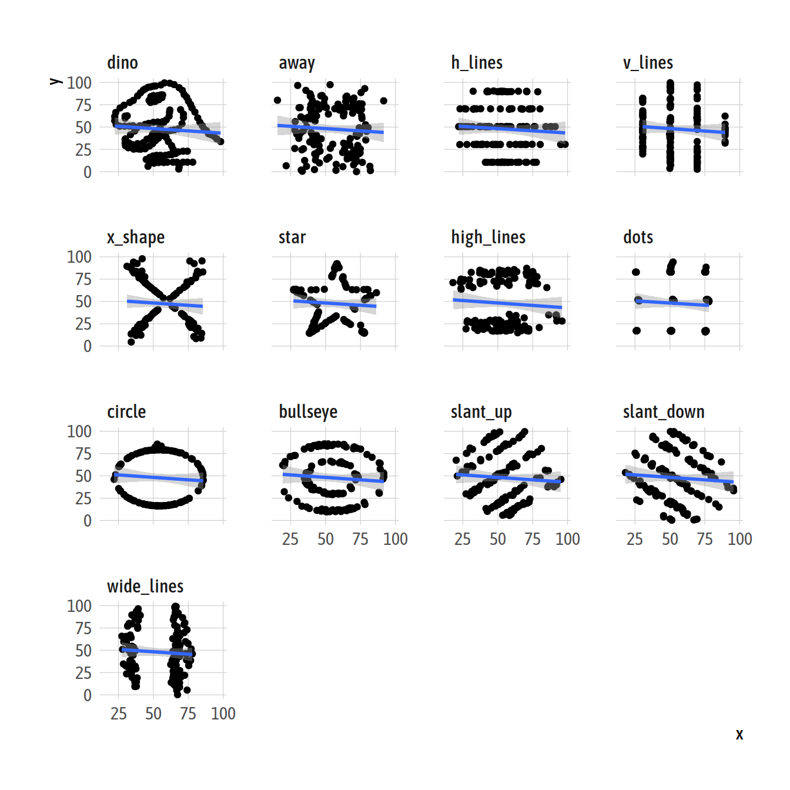
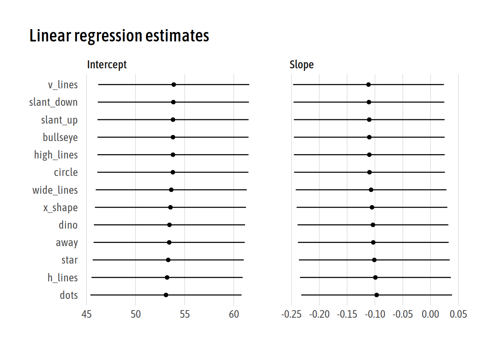
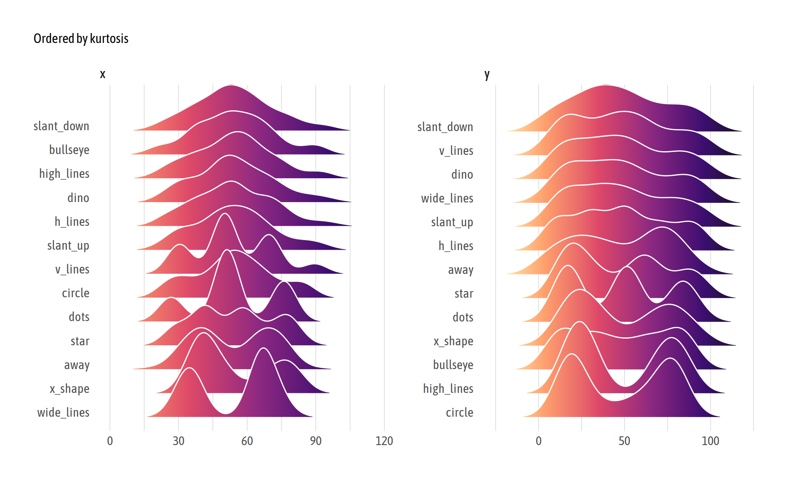

TidyTuesday 2020/42: Datasaurus Dozen
================

``` r
library(tidyverse)
library(tidytext)
library(ggridges)
library(gganimate)

source(here::here("scripts/default_theme.R"))
```

``` r
datasaurus <- read_csv("https://github.com/rfordatascience/tidytuesday/raw/master/data/2020/2020-10-13/datasaurus.csv")

glimpse(datasaurus)
#> Rows: 1,846
#> Columns: 3
#> $ dataset <chr> "dino", "dino", "dino", "dino", "dino", "dino", "dino", "dino…
#> $ x       <dbl> 55.3846, 51.5385, 46.1538, 42.8205, 40.7692, 38.7179, 35.6410…
#> $ y       <dbl> 97.1795, 96.0256, 94.4872, 91.4103, 88.3333, 84.8718, 79.8718…
```

``` r
datasaurus %>% 
  mutate(dataset = as_factor(dataset)) %>% 
  ggplot(aes(x, y)) +
  geom_point() +
  geom_smooth(method = "lm") +
  facet_wrap(~dataset) +
  panel_grid()
#> `geom_smooth()` using formula 'y ~ x'
```



``` r
datasaurus_lm <- datasaurus %>% 
  nest(data = -dataset) %>% 
  mutate(model = map(data, ~ lm(y ~ x, data = .x)),
         coefs = map(model, broom::tidy)) %>% 
  unnest(coefs)

datasaurus_lm
#> # A tibble: 26 x 8
#>    dataset data            model term      estimate std.error statistic  p.value
#>    <chr>   <list>          <lis> <chr>        <dbl>     <dbl>     <dbl>    <dbl>
#>  1 dino    <tibble [142 ×… <lm>  (Interce…  53.5        7.69      6.95  1.29e-10
#>  2 dino    <tibble [142 ×… <lm>  x          -0.104      0.136    -0.764 4.46e- 1
#>  3 away    <tibble [142 ×… <lm>  (Interce…  53.4        7.69      6.94  1.31e-10
#>  4 away    <tibble [142 ×… <lm>  x          -0.103      0.135    -0.760 4.48e- 1
#>  5 h_lines <tibble [142 ×… <lm>  (Interce…  53.2        7.70      6.91  1.53e-10
#>  6 h_lines <tibble [142 ×… <lm>  x          -0.0992     0.136    -0.732 4.66e- 1
#>  7 v_lines <tibble [142 ×… <lm>  (Interce…  53.9        7.69      7.01  9.38e-11
#>  8 v_lines <tibble [142 ×… <lm>  x          -0.112      0.135    -0.824 4.12e- 1
#>  9 x_shape <tibble [142 ×… <lm>  (Interce…  53.6        7.69      6.97  1.17e-10
#> 10 x_shape <tibble [142 ×… <lm>  x          -0.105      0.135    -0.778 4.38e- 1
#> # … with 16 more rows
```

``` r
datasaurus_lm %>% 
  mutate(term = if_else(term == "x", "Slope", "Intercept")) %>% 
  ggplot(aes(estimate, fct_reorder(dataset, estimate, max))) +
  geom_point() +
  geom_errorbarh(aes(xmin = estimate - std.error,
                     xmax = estimate + std.error),
                 height = 0) +
  labs(x = NULL, y = NULL, title = "Linear regression estimates") +
  panel_grid("X") +
  facet_wrap(~term, scales = "free_x")
```



``` r
datasaurus %>% 
  pivot_longer(-dataset) %>% 
  ggplot(aes(value,
             reorder_within(dataset, value, name, PerformanceAnalytics::kurtosis),
             fill = stat(x))) +
  geom_density_ridges_gradient(colour = "white", show.legend = FALSE,
                               scale = 3, rel_min_height = .01) +
  scale_y_reordered() +
  scale_fill_viridis_c(option = "A", direction = -1) +
  facet_wrap(~name, scales = "free") +
  labs(x = NULL, y = NULL, subtitle = "Ordered by kurtosis") +
  panel_grid("Xx") +
  theme(axis.text.y = element_text(vjust = 0))
#> Picking joint bandwidth of 5.46
#> Picking joint bandwidth of 9
```



``` r
theme_set(ggCyberPunk::theme_cyberpunk(font = "Bandal",
                                       base.size = 18, title.size = 20) +
            theme(strip.text = element_text(family = "Bandal"),
                  axis.text.y = element_text(hjust = 1, margin = margin(r = 5))))

geom_glowing_hline <- function(..., alpha = 1, size = 1.2, glow_alpha = .03, layers = 10L) {
  geoms <- vector(mode = "list", length = layers)
  for (i in seq_len(layers)) {
    geoms <- c(geoms, geom_hline(...,
                                 size = size * 4 - (1 - (i - 1) / layers),
                                 alpha = alpha * glow_alpha))
  }
  geoms <- c(geoms,
             geom_hline(..., size = size * 1, alpha = alpha),
             geom_hline(..., colour = "white", size = size * .4, alpha = alpha * .4))
}

geom_glowing_text <- function(..., alpha = 1, size = 3.5, glow_alpha = .15, layers = 10L) {
  geoms <- vector(mode = "list", length = layers)
  for (i in seq_len(layers)) {
    geoms <- c(geoms, geom_text(...,
                                size = size + i * .05,
                                alpha = alpha * glow_alpha))
  }
  geoms <- c(geoms,
             geom_text(..., size = size, alpha = alpha),
             geom_text(..., colour = "white", size = size, alpha = alpha * .4))
}

cumsd <- function (x) {
  x <- x - x[sample.int(length(x), 1)]
  n <- seq_along(x)
  sd <- sqrt((cumsum(x ^ 2) - cumsum(x) ^ 2 / n) / (n - 1))
  sd
}

cyberpunk_prep <- datasaurus %>% 
  mutate(dataset = as_factor(str_to_upper(dataset))) %>% 
  group_by(dataset) %>% 
  arrange(x) %>% 
  mutate(cummean_y = cummean(y),
         cumsd_y = format(cumsd(y), digits = 1, nsmall = 1)) %>% 
  ungroup()

anim_cyberpunk <- cyberpunk_prep %>% 
  ggplot(aes(x, y)) +
  geom_point(aes(group = seq_along(x)), colour = "#EE9537", size = .3) +
  geom_glowing_hline(aes(yintercept = cummean_y, colour = dataset), show.legend = FALSE) +
  geom_glowing_text(aes(90, 10, label = cumsd_y, colour = dataset),
                    family = "Bandal", show.legend = FALSE) +
  facet_wrap(~dataset) + 
  labs(x = "Standard deviation in the bottom right corner of each plot.", y = NULL,
       title = "Cumulative mean and standard deviation of Y") +
  transition_reveal(x)
```

``` r
animate(anim_cyberpunk, nframes = 60, end_pause = 4,
        width = 600, height = 600, units = "px")
```

<!-- -->
