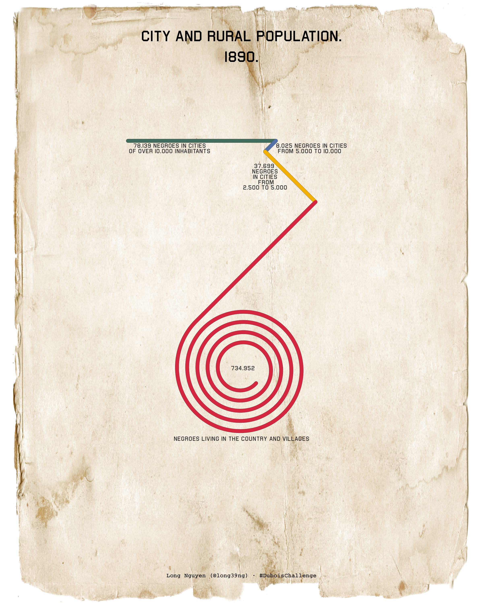

TidyTuesday 2021/08: Du Bois Challenge
================

``` r
library(tidyverse)
library(magick)
```

``` r
orig <- "https://raw.githubusercontent.com/ajstarks/dubois-data-portraits/master/challenge/challenge06/original-plate-11.jpg" %>% 
  image_read()

bg_img <- "https://upload.wikimedia.org/wikipedia/commons/8/86/Tattered_Edges.png" %>% 
  # Originally posted to Flickr by Playingwithbrushes at
  # https://flickr.com/photos/82518118@N00/2926159152
  image_read() %>% 
  image_fill(color = "transparent", refcolor = "white", fuzz = 4) %>% 
  image_modulate(brightness = 150) %>% 
  image_flip() %>% 
  image_raster(tidy = FALSE)

city_rural <- "https://raw.githubusercontent.com/rfordatascience/tidytuesday/master/data/2021/2021-02-16/city_rural.csv" %>% 
  readr::read_csv()
#> 
#> ── Column specification ────────────────────────────────────────────────────────
#> cols(
#>   Category = col_character(),
#>   Population = col_double()
#> )

pop_lineend <- 9e4

lines_data <- city_rural %>% 
  mutate(Population = if_else(Category == last(Category), pop_lineend, Population),
         colour = c("#406C5C", "#5472A8", "#F2B100", "#D4273F"),
         angle = c(0, 135, 45, 135)) %>% 
  `[<-`(c("x", "xend", "y", "yend"), value = NA_real_)

# This is clunky
for (i in seq_len(nrow(lines_data))) {
  lines_data <- lines_data %>% 
    mutate(x = if_else(row_number() == i, lag(xend, default = 0), x),
           xend = if_else(row_number() == i,
                          x + Population * cos(2 * pi * angle / 360),
                          xend),
           y = if_else(row_number() == i, lag(yend, default = 0), y),
           yend = if_else(row_number() == i,
                          y + Population * sin(2 * pi * angle / 360),
                          yend))
}

spiral_data <- tibble(a = 1e4,
                      b = 857.26, # Trial and error - to get correct spiral length
                      theta = seq(0, 9 * pi, length = 1e4) -
                        2 * pi * -45 / 360, # Rotate 45° CCW
                      r = a + b * theta,
                      x = r * cos(theta),
                      y = r * sin(theta)) %>%
  # Spiral starts at end of last line:
  mutate(x = x + last(lines_data$xend) - last(x),
         y = y + last(lines_data$yend) - last(y))

# Check spiral length:
# last(city_rural$Population) - pop_lineend
# spiral_data %>% 
#   mutate(dist = sqrt((x - lag(x))^2 + (y - lag(y))^2)) %>%
#   summarise(sum(dist, na.rm = TRUE)) # Close enough
```

``` r
lines_data %>% 
  ggplot(aes(x, y)) +
  annotation_raster(bg_img, xmin = -Inf, xmax = Inf, ymin = -Inf, ymax = Inf) +
  geom_segment(aes(xend = xend, yend = yend),
               lineend = "round", size = 2.1, show.legend = FALSE) +
  geom_path(data = spiral_data,
            size = 2.1, lineend = "round") +
  geom_segment(aes(xend = xend, yend = yend, colour = colour),
               lineend = "round", size = 2, show.legend = FALSE) +
  geom_path(data = spiral_data,
            colour = last(lines_data$colour), size = 2, lineend = "round") +
  scale_x_continuous(limits = c(-5e4, 17e4)) +
  scale_y_reverse(limits = c(23e4, -6e4)) +
  scale_colour_identity() +
  coord_equal() +
  annotate("text", x = mean(c(-5e4, 17e4)), y = -5e4,
           label = "CITY AND RURAL POPULATION.\n1890.",
           family = "Airborne II Pilot", size = 6) +
  annotate("text", x = 22e3, y = 4e3,
           label = paste(format(city_rural$Population[1], big.mark = ","),
                         "NEGROES IN CITIES\nOF OVER 10,000 INHABITANTS"),
           family = "Airborne II Pilot", size = 2.5, lineheight = .75,
           colour = "grey20") +
  annotate("text", x = lines_data$x[2], y = 4e3,
           label = paste(format(city_rural$Population[2], big.mark = ","),
                         "NEGROES IN CITIES\n FROM 5,000 TO 10,000"),
           family = "Airborne II Pilot", size = 2.5, lineheight = .75,
           hjust = "left", colour = "grey20") +
  annotate("text", x = lines_data$x[3], y = mean(lines_data$y[3:4]),
           label = paste(format(city_rural$Population[3], big.mark = ","),
                         "\nNEGROES\nIN CITIES\n FROM\n2,500 TO 5,000"),
           family = "Airborne II Pilot", size = 2.5, lineheight = .75,
           colour = "grey20") +
  annotate("text", x = spiral_data$x[1] - 7e3, y = spiral_data$y[1] - 8e3,
           label = format(city_rural$Population[4], big.mark = ","),
           family = "Airborne II Pilot", size = 2.5, colour = "grey20") +
  annotate("text", x = mean(c(-5e4, 17e4)), y = max(spiral_data$y) + 4e3,
           label = toupper(paste("negroes living in the", city_rural$Category[4])),
           family = "Airborne II Pilot", size = 2.5, colour = "grey20") +
  annotate("text", x = mean(c(-5e4, 17e4)), y = 23e4,
           label = "Long Nguyen (@long39ng) · #DuboisChallenge",
           family = "Courier", fontface = "bold", size = 2.5) +
  theme_void()
```

<!-- -->

<details>
<summary>
Session information
</summary>

``` r
sessionInfo()
#> R version 4.0.4 (2021-02-15)
#> Platform: x86_64-pc-linux-gnu (64-bit)
#> Running under: openSUSE Leap 15.2
#> 
#> Matrix products: default
#> BLAS/LAPACK: /usr/lib64/libopenblas_pthreads.so.0
#> 
#> locale:
#>  [1] LC_CTYPE=en_GB.UTF-8       LC_NUMERIC=C              
#>  [3] LC_TIME=en_GB.UTF-8        LC_COLLATE=en_GB.UTF-8    
#>  [5] LC_MONETARY=en_GB.UTF-8    LC_MESSAGES=en_GB.UTF-8   
#>  [7] LC_PAPER=en_GB.UTF-8       LC_NAME=C                 
#>  [9] LC_ADDRESS=C               LC_TELEPHONE=C            
#> [11] LC_MEASUREMENT=en_GB.UTF-8 LC_IDENTIFICATION=C       
#> 
#> attached base packages:
#> [1] stats     graphics  grDevices utils     datasets  methods   base     
#> 
#> other attached packages:
#>  [1] magick_2.6.0    forcats_0.5.1   stringr_1.4.0   dplyr_1.0.4    
#>  [5] purrr_0.3.4     readr_1.4.0     tidyr_1.1.2     tibble_3.0.6   
#>  [9] ggplot2_3.3.3   tidyverse_1.3.0
#> 
#> loaded via a namespace (and not attached):
#>  [1] tidyselect_1.1.0  xfun_0.21         haven_2.3.1       colorspace_2.0-0 
#>  [5] vctrs_0.3.6       generics_0.1.0    htmltools_0.5.1.1 yaml_2.2.1       
#>  [9] rlang_0.4.10      pillar_1.4.7      glue_1.4.2        withr_2.4.1      
#> [13] DBI_1.1.1         dbplyr_2.1.0      modelr_0.1.8      readxl_1.3.1     
#> [17] lifecycle_1.0.0   munsell_0.5.0     gtable_0.3.0      cellranger_1.1.0 
#> [21] ragg_1.1.0        rvest_0.99.0.9000 evaluate_0.14     labeling_0.4.2   
#> [25] knitr_1.31        curl_4.3          parallel_4.0.4    highr_0.8        
#> [29] broom_0.7.4       Rcpp_1.0.6        scales_1.1.1      backports_1.2.1  
#> [33] jsonlite_1.7.2    farver_2.0.3      systemfonts_1.0.1 fs_1.5.0         
#> [37] textshaping_0.3.0 hms_1.0.0         digest_0.6.27     stringi_1.5.3    
#> [41] grid_4.0.4        cli_2.3.0         tools_4.0.4       magrittr_2.0.1   
#> [45] crayon_1.4.1      pkgconfig_2.0.3   ellipsis_0.3.1    xml2_1.3.2       
#> [49] reprex_1.0.0      lubridate_1.7.9.2 assertthat_0.2.1  rmarkdown_2.7.1  
#> [53] httr_1.4.2        rstudioapi_0.13   R6_2.5.0          compiler_4.0.4
```

</details>
