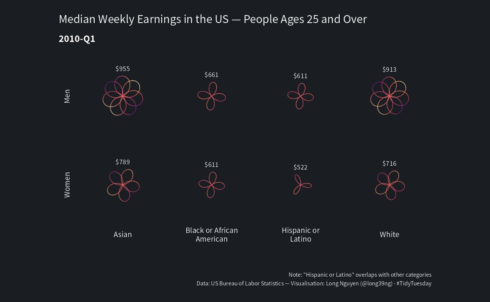

```{r setup, include=FALSE}
knitr::opts_chunk$set(echo = TRUE, collapse = TRUE, comment = "#>")
```

```{r load, message=FALSE}
library(tidyverse)
library(ragg)
```

```{r data}
earn <- "https://raw.githubusercontent.com/rfordatascience/tidytuesday/master/data/2021/2021-02-23/earn.csv" %>% 
  read_csv(col_types = "cccciiii")
```

```{r generate}
rose <- function(petals, angle = 0, scale = 1) {
  rad <- pi * angle / 180
  df <- data.frame(theta = seq(0, (petals - 2) * pi, by = pi / 180)) %>% 
    mutate(x = scale * cos(petals / (petals - 2) * theta + rad) * cos(theta),
           y = scale * cos(petals / (petals - 2) * theta + rad) * sin(theta))
  df
}

roses <- earn %>% 
  mutate(quarter_label = glue::glue("{year}-Q{quarter}"),
         date = lubridate::yq(quarter_label),
         race2 = if_else(race == "All Races", ethnic_origin, race)) %>%
  filter(age == "25 years and over",
         race2 != "All Origins",
         sex != "Both Sexes") %>% 
  mutate(petals = median_weekly_earn %/% 100 - 2) %>% 
  group_by(sex, race2) %>% 
  mutate(angle = row_number() * 15,
         points = pmap(
           list(petals, angle, median_weekly_earn),
           function(x, y, z) rose(petals = x, angle = y, scale = z)
         )) %>% 
  ungroup() %>% 
  select(sex, race2, quarter_label, median_weekly_earn, points) %>% 
  unnest(points) %>% 
  group_split(quarter_label)
```

```{r frames, warning=FALSE}
agg_png("figs/tmp/frame-%02d.png",
        width = 1294, height = 800, res = 96, bg = "#1A1D21")

walk(roses, ~ print({
  .x %>% 
  group_by(sex, race2) %>% 
  mutate(max_y = max(y),
         median_weekly_earn = if_else(row_number() == 1,
                                      median_weekly_earn,
                                      NA_integer_)) %>% 
  ungroup() %>% 
  ggplot() +
  geom_path(aes(x, y, colour = x * y), show.legend = FALSE) +
  geom_text(aes(x = 0, y = max_y,
                label = scales::dollar(median_weekly_earn)),
            colour = "white", size = 5, nudge_y = 350) +
  scale_colour_viridis_c(option = "magma", begin = .3) +
  facet_grid(sex ~ str_wrap(race2, 17), switch = "both") +
  coord_equal(xlim = 1800 * c(-1, 1), ylim = 1800 * c(-1, 1), clip = "off") +
  labs(title = "Median Weekly Earning in the US — People Ages 25 and Over",
       subtitle = .x$quarter_label[1],
       caption = "Note: \"Hispanic or Latino\" overlaps with other categories\nData: US Bureau of Labor Statistics — Visualisation: Long Nguyen (@long39ng) · #TidyTuesday") +
  theme_void(base_size = 20) +
  theme(text = element_text(family = "Source Sans Pro",
                            colour = "white"),
        plot.background = element_rect(fill = "#1A1D21", colour = "#1A1D21"),
        plot.margin = margin(20, 20, 20, 20),
        plot.title.position = "plot",
        plot.subtitle = element_text(face = "bold",
                                     margin = margin(20, 10, 20, 10)),
        plot.caption = element_text(size = 12,
                                    lineheight = 1.2,
                                    margin = margin(60, 10, 10, 10)),
        plot.caption.position = "plot",
        strip.text.y = element_text(margin = margin(10, 20, 10, 10)))
}))

dev.off()
```

```{r roses-gif}
system("convert -delay 25 figs/tmp/*.png figs/roses.gif")
fs::dir_delete("figs/tmp/")
```



<details><summary>Session information</summary>
```{r sesh}
sessionInfo()
```
</details>
