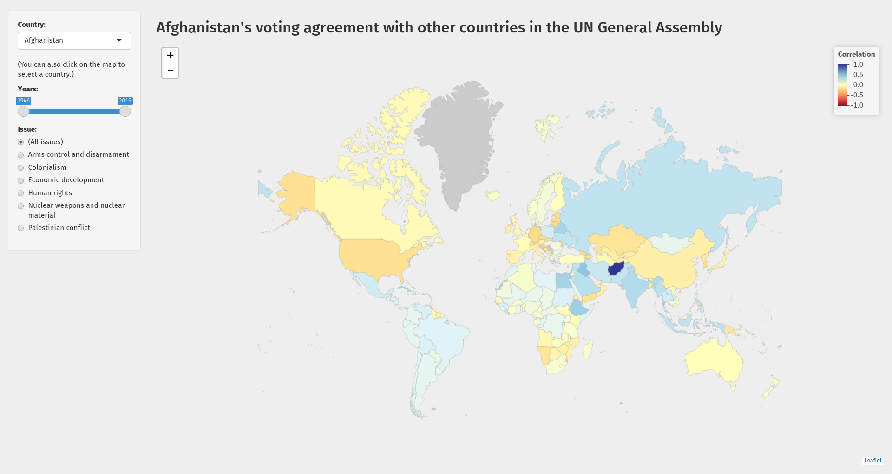
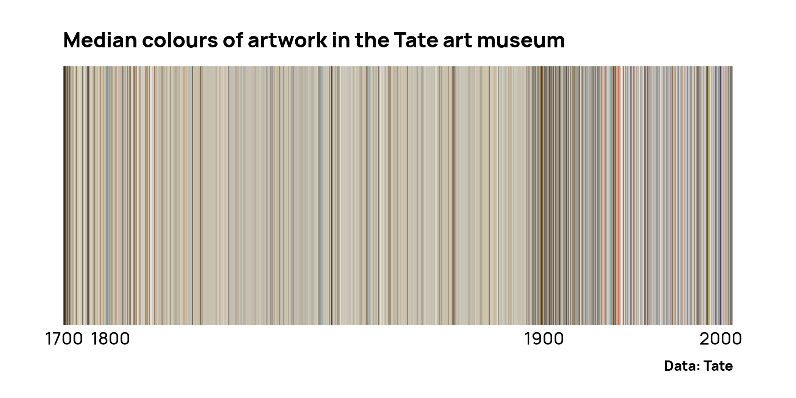
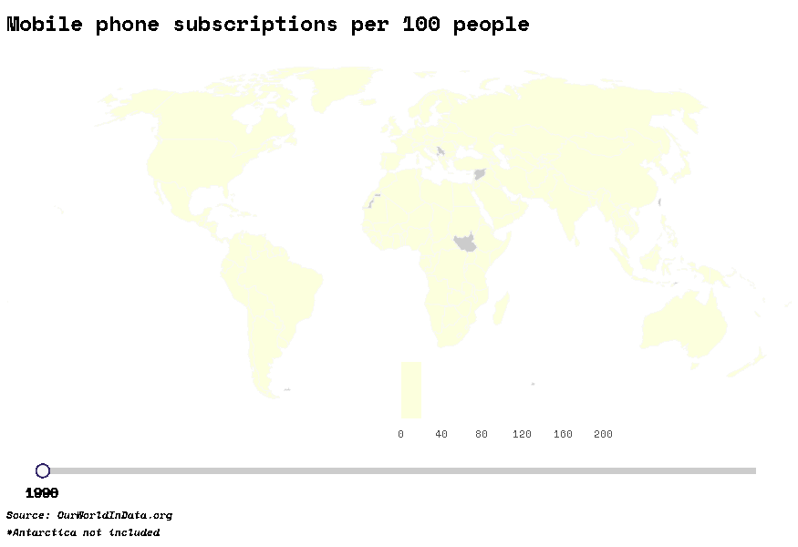

# TidyTuesday

My attempts at [#tidytuesday](https://github.com/rfordatascience/tidytuesday)

## 2021

| <!-- --> | <!-- --> | <!-- --> |
| --- | --- | --- |
| [Week 13 (2021-03-23)](2021_13_un_votes) | [UN Votes](2021_13_un_votes) |  |
| [Week 11 (2021-03-09)](2021_11_bechdel_test) | [Bechdel Test](2021_11_bechdel_test) |  |
| [Week 9 (2021-02-23)](2021_09_employed_status) | [Employed Status](2021_09_employed_status) |  |
| [Week 8 (2021-02-16)](2021_08_dubois_challenge) | [DuBois Challenge](2021_08_dubois_challenge) |   |
| [Week 3 (2021-01-12)](2021_03_art_collections) | [Art collections](2021_03_art_collections) |  |

## 2020

| <!-- --> | <!-- --> | <!-- --> |
| --- | --- | --- |
| [Week 52 (2020-12-22)](2020_52_big_mac_index) | [The Big Mac Index](2020_52_big_mac_index) |  |
| [Week 50 (2020-12-08)](2020_50_women_of_2020) | [Women of 2020](2020_50_women_of_2020) |  |
| [Week 48 (2020-11-24)](2020_48_washington_trails) | [Washington Trails](2020_48_washington_trails) |  |
| [Week 46 (2020-11-10)](2020_46_historical_phones) | [Historical Phones](2020_46_historical_phones) |  |
| [Week 45 (2020-11-03)](2020_45_ikea_furniture) | [IKEA Furniture](2020_45_ikea_furniture) |  |
| [Week 44 (2020-10-27)](2020_44_canadian_wind_turbines) | [Canadian Wind Turbines](2020_44_canadian_wind_turbines) |  |
| [Week 42 (2020-10-13)](2020_42_datasaurus) | [`datasauRus` Dozen](2020_42_datasaurus) |  |
